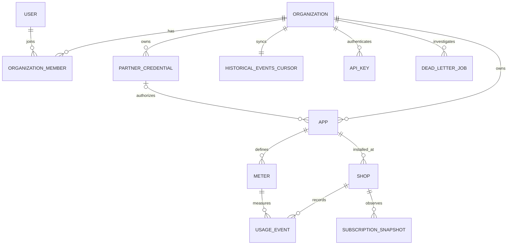

# OpenMantle architecture

OpenMantle is a multi-tenant control plane between Shopify app developers and Shopify App Pricing. The initial boundary is intentionally small: PostgreSQL is the source of truth, Fastify serves the API, BullMQ owns asynchronous work, Redis backs queues, and Caddy is the public reverse proxy.

## Tenant isolation

All tenant tables carry `organization_id`. Each request opens a transaction and runs `set_config('app.current_org_id', organization_id, true)` before tenant queries. The setting is transaction-local, so a pooled connection cannot leak tenant identity into its next checkout. PostgreSQL RLS is enabled and forced on every tenant table.

Global user lookup and API-key bootstrap use two narrow `SECURITY DEFINER` functions. They return only the fields required to establish identity. Once identity is established, ordinary queries run through RLS.

The unauthenticated Shopify welcome-link route uses a similarly narrow lookup keyed by the OpenMantle app ID and exact `.myshopify.com` domain. It never trusts `plan_handle` by itself: it confirms the current subscription through the Partner API first.

## Authentication

Dashboard sessions are 12-hour HS256 JWTs with user, organization, and role claims. Passwords use Argon2id. Public SDK keys use `om_<prefix>.<secret>` format; only a SHA-256 digest of the random secret is stored, and the full key is returned only at creation.

Partner access tokens are encrypted with AES-256-GCM. All Partner calls pass through a Redis sliding-window limiter scoped to the stored credential, allowing at most three requests in any rolling second. This leaves headroom beneath Shopify's four-request-per-second Partner client limit. HTTP errors and GraphQL errors returned inside HTTP 200 responses share the same retry/error path.

App Events client secrets are separate per-app credentials and use the same authenticated encryption envelope. Short-lived Shopify access tokens are cached in Redis per app, with a one-minute refresh margin and a forced refresh after a `401`.

## Usage forwarding

`POST /v1/usage` authenticates an organization by API key, resolves the meter against the shop's app under RLS, and inserts before touching Redis. The unique `(shop_id, idempotency_key)` constraint is the source of truth for idempotency. A retry of a pending event also repairs a missed enqueue.

Queue jobs are grouped by shop and meter after a short delay. A Redis lease prevents two workers from forwarding the same group concurrently. Each worker selects up to the configured batch size, increments per-event attempt counts, and sends one App Events request per event because Shopify does not accept batch requests. Successful events become `reported`; terminal failures become `failed` and create a `dead_letter_jobs` record. Events that arrived after a failing batch are not swept into that batch's terminal failure.

## Subscription-change webhooks

The snapshot writer compares the normalized subscription payload with the previous observation. On a change, it inserts one `webhook_deliveries` outbox row per active app endpoint inside the snapshot transaction. An organization-scoped recurring BullMQ job claims due deliveries with `FOR UPDATE SKIP LOCKED`, places a short processing lease in `next_attempt_at`, and sends them outside the database transaction.

Secrets are generated once, encrypted at rest, and returned only when the endpoint is created. Requests are signed as `HMAC-SHA256(secret, timestamp + "." + exactBody)`. Non-2xx responses and transport failures use exponential backoff for up to eight attempts. Redirects are disabled, and production endpoint URLs must use HTTPS.
