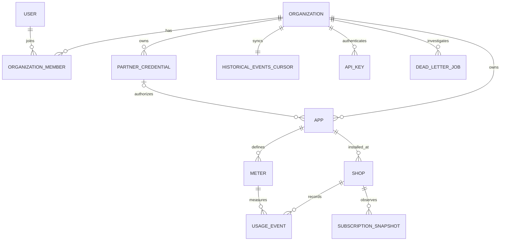

# OpenMantle architecture

OpenMantle is a multi-tenant control plane between Shopify app developers and Shopify App Pricing. The initial boundary is intentionally small: PostgreSQL is the source of truth, Fastify serves the API, BullMQ owns asynchronous work, Redis backs queues, and Caddy is the public reverse proxy.

## Tenant isolation

All tenant tables carry `organization_id`. Each request opens a transaction and runs `set_config('app.current_org_id', organization_id, true)` before tenant queries. The setting is transaction-local, so a pooled connection cannot leak tenant identity into its next checkout. PostgreSQL RLS is enabled and forced on every tenant table.

Global user lookup and API-key bootstrap use two narrow `SECURITY DEFINER` functions. They return only the fields required to establish identity. Once identity is established, ordinary queries run through RLS.

## Authentication

Dashboard sessions are 12-hour HS256 JWTs with user, organization, and role claims. Passwords use Argon2id. Public SDK keys use `om_<prefix>.<secret>` format; only a SHA-256 digest of the random secret is stored, and the full key is returned only at creation.
